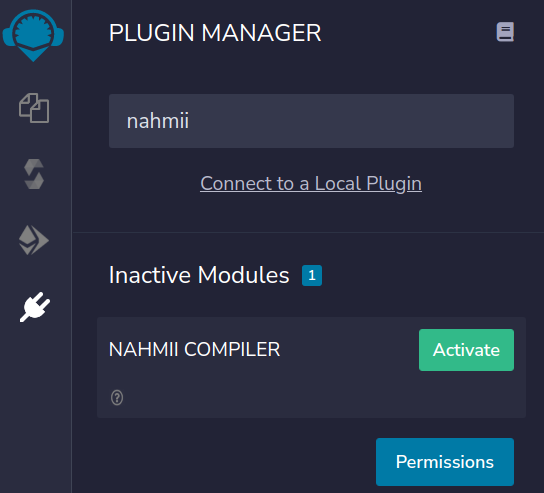
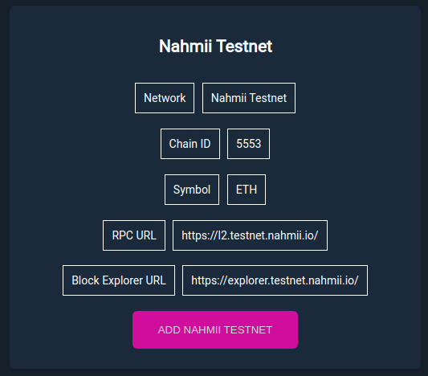
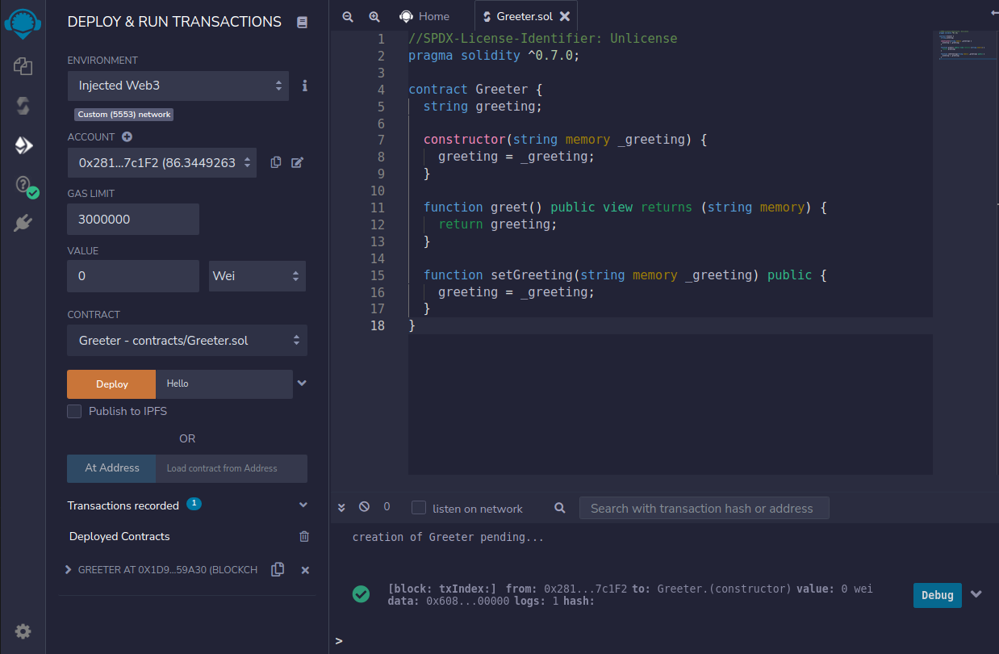

# Remix Nahmii Compiler

<TODO>

## Install

In the Remix plugin manager activate Nahmii Compiler.



Now you should be able to compile Nahmii compatible smart contracts.

### Local plugin

In case the plugin does not show up in Remix or you're looking to run a local instance of the plugin, clone the [remix-nahmii-compiler-plugin](https://github.com/nahmii-community/remix-nahmii-compiler-plugin).

First clone this repository and install dependencies with `yarn` by executing the following commands:

```
git clone git@github.com:Machinalabs/remix-nahmii-compiler-plugin.git

yarn
```

To start the project run:
```
yarn start
```

Once you've started the application, open the [Remix IDE](https://remix.ethereum.org/).

Navigate to the `Plugin Manager` in Remix and click on `Connect to a Local Plugin`. A new window should popup that asks you to fill in details for the local plugin.

Fill in the following details:
Plugin Name: nahmii-compiler
Display Name: Nahmii Compiler
Api: compile,getCompilationResult,setCompilerConfig,compileWithParameters,compilationFinished
Url: http://localhost:8080/

Click `OK` and the plugin should now appear in your Remix IDE. You can now use the plugin like the regular Solidity compiler within Remix.

## Deploy to Nahmii Testnet using Remix

For this example we will use the following contract

```javascript
//SPDX-License-Identifier: Unlicense
pragma solidity ^0.7.0;

contract Greeter {
  string greeting;

  constructor(string memory _greeting) {
    greeting = _greeting;
  }

  function greet() public view returns (string memory) {
    return greeting;
  }

  function setGreeting(string memory _greeting) public {
    greeting = _greeting;
  }
}
```

We will assume you have funds in Nahmii Testnet. 

Now, go to the Nahmii compiler and compile the contract.

Switch metamask to Nahmii Testnet by going to [connect-nahmii-2](https://nahmii-community.github.io/connect-nahmii-2/) and clicking `Add Nahmii Testnet`.



Be sure metamask is in the following network:


Now go to the Deploy & Run transactions plugin and select injected provider and deploy the contract.



<IMAGE_DEPLOY>

## Issues

If you have any issues, please feel free to create an issue in our [Github repository](https://github.com/Machinalabs/remix-optimism-compiler-plugin/issues).